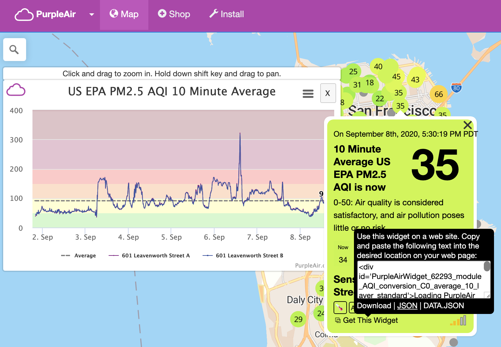

# AQI Bat

This project is a little hack that allows a Linux box to play an audio file whenever the Air Quality Index rises above or falls below specified thresholds. We mostly use this at night, to let us know when to close the window if the AQI is low enough to keep it open when we go to sleep, or, conversely, to let us know when we can open the window if we had to close up the house to keep the smoke out.

Presently this is just a lightweight proof-of-concept / hack. It uses the [Purple Air API](https://www.purpleair.com/sensorlist) to determine the local Air Quality Index.

## Installation and Setup

There are three steps to setting up this project:

1. Install the cron job
2. Set up the web server
3. Configure PulseAudio to run in system mode

Note that since this project is just a hack, it has a couple of hardcoded paths that will need to be updated.

### Cron

The cron script is located at the root of the project. It can run as a non-priviledged user. Set up a cron entry for it that looks something like this:
```
*/10 * * * * /usr/bin/env XDG_RUNTIME_DIR="/run/user/1000" php /home/ga/aqi-bat/aqi-bat.php
```
Alter the path to the script to align with the location where you cloned this project.

Some notes:

1. The example schedule runs the script once every ten minutes. Adjust to suit, but do note that the purple air API has a rate limit that will throttle you if you send too many requests.
2. The sensor URL is written in the prefs.json file in the configuration directory. The configuration directory will be created at $HOME/.aqi-bat on the first run of the tool.
3. To find the URL of a different session to use, click on the desired sensor, click on "Get This Widget", and then copy the URL from the "JSON" link in the popup. Put this link in the `'sensor-url'` item in the preferences file.



### Web Server

Make a symbolic link from your web server directory to the `htdocs` directory in this project.
```
ln -s '/path/to/aqi-bat/htdocs' '/var/www/aqi-bat'
```
This project is just a hack, so you'll have to hand-modify the index.php and threshold.php files to point at the configuration directory created by the cron script.

Configure your web server to serve files from this directory. See the [example Apache configuration](examples/apache2/aqi.bat.conf) for a start.

Make sure that the web server can write to the configuration files:
```
chown -R www-data $HOME/.aqi-bat
```

### PulseAudio

By default, pulse audio runs in user mode. This is the right configuration for most use cases; however, in user mode it is not possible to play sounds from any environment other than a logged-in user session. In order to play sounds from a web server, you will need to [configure pulse audio to run in system mode](https://www.freedesktop.org/wiki/Software/PulseAudio/Documentation/User/SystemWide/). Please be sure that you [understand the limitations and problems](https://www.freedesktop.org/wiki/Software/PulseAudio/Documentation/User/WhatIsWrongWithSystemWide/) with running in this configuration before you procede.

#### Disable restart of pulseaudio in client / user mode

In /etc/pulse/client.conf:
```
autospawn = no
```

#### Turn off user-mode pulseaudio in systemd
```
sudo systemctl --global disable pulseaudio.service pulseaudio.socket
```
I'm not sure if this did anything; pulseaudio might not have been configured in systemd on my system (Ubuntu 18.04). The command above did run without producing an error, though.

#### Create a pulseadio systemd service for system mode

Create /etc/systemd/system/pulseaudio.service:
```
[Unit]
Description=PulseAudio system server

[Service]
Type=notify
ExecStart=/usr/bin/pulseaudio --daemonize=no --system --realtime --log-target=journal

[Install]
WantedBy=multi-user.target
```

#### Enable the pulseaudio systemd service 
``` 
systemctl --system enable pulseaudio.service
systemctl --system start pulseaudio.service
```
#### Allow anonymous users to use sound

In vi /etc/pulse/system.pa:
```
load-module module-native-protocol-unix auth-anonymous=1
```

#### Play a test sound
```
/usr/bin/env XDG_RUNTIME_DIR="/run/user/1000" mpg123 examples/sounds/test.mp3
```
